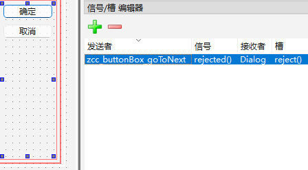

# Develop manual

[toc]

---

## UI design

I use the _pyside6-designer.exe_ for UI design.
The _*.ui_ files are placed in the [layout](./layout) folder.

### Main window

The main entrance of the application is the [data_selection.ui](./layout/data_selection.ui)

#### How does it open the protocols UI?

I unbind the _accepted()_ signal of the buttonBox slots,
and reassign it with protocol UI starter.
Since the _rejected()_ signal is kept, it closes the window immediately.



```python

'''
File: python/qt/window_of_data_selection.py
Class: DataSelectionWindow
'''

def handle_goToNext_events(self):

    def _accept():
        unknown_protocol = True

        if self.protocol == 'MI':
            window = MIWindow(self.chosen_files, self.window)
            window.show()
            unknown_protocol = False

        if unknown_protocol:
            logger.warning('Not support protocol: {self.protocol}')

    self.buttonBox_goToNext.accepted.connect(_accept)
```

### Motion imaging UI

The motion imaging protocol UI is the [MI.ui](./layout/MI.ui),
which is handled by the _MIWindow_ class.
The _window.show()_ method shows it.

## Appendix
